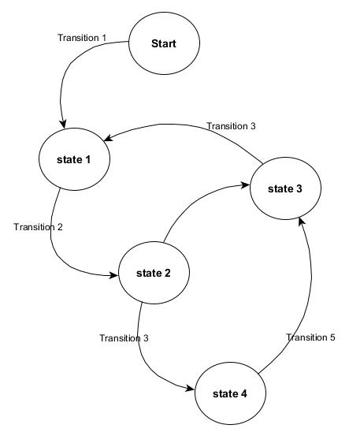
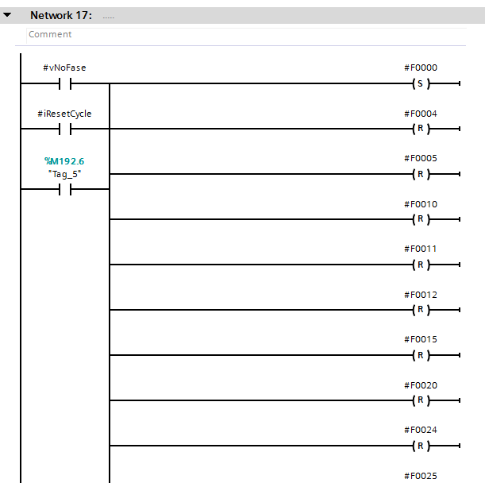
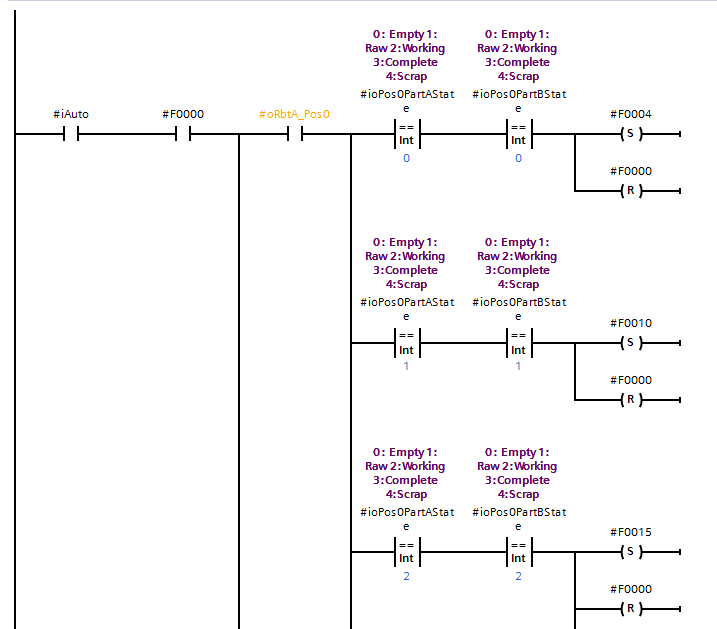

*******************
State machine
*******************

.. note:: State machine diagram are drawing in yEd_ Graph editor from yWorks_.

:download:`Download Exercises solutions <../../../code/Exercises/Siemens/Exercises/Exercises.zip>`

Concepts
=========
A state machine have 2 componets:
  - ``State`` represented as a circle.
  - ``Transition`` represented as an arrow. The transition is the condition to change state.

    State machine: States and Transitions

For example a lamp may have 2 states: ON or OFF. The transition from one state to another is determined by a switch.

.. figure:: images/lamp_state.jpg
    :align: center
    :figwidth: 400px

    Lamp states: ON or OFF

When writing software, first we begin with normal operations i.e. how the device should work, then we add abnormal situations. For example, we say a lamp may have only two states, in normal operations. But a lamp may be broken. Now a simple lamp have three states. If we have a smart lamp (with internal diagnostic and MCU) the number of states may become more than three.

For example a pneumatic cylinder, can be opened or closed. It may also move in 2 directions, so it may have other 2 states, opening and closing.
The cylinder may also be in a middle position, in our case we consider it as unknown position, it is in an alarm state.

.. figure:: images/statediag.jpg
    :align: center
    :figwidth: 400px

The diagram show the states and transition from one state to another. As we can see, the cylinder can't go from ``closed`` to ``opened`` directly.
To the ``alarm`` state we can arrive from any state.

We can make a transition from opening to closing directly. Suppose I was opening, but before to open completely I change idea, and want o close.
But usually this is not the case when dealing, for example with a gripper that need to hold or leave an object.
Anyway, depending on the application, transitions from one state to another can be considered or not.

Implementation
===============

Siemens doesn't implement the ``enumeration`` data type.
For better readability we emulate the enumeration data types by creating CONSTANTS with the name of the state.

.. figure:: images/cylinder_var.png
    :align: center
    :figwidth: 600px

    State declared as CONSTANT variables with unique number or identifier.
    This interface is valid for implementation in SCL and in Ladder.

Compare the following two implementations:

.. figure:: images/state_name.png
    :align: center
    :figwidth: 600px

    States are represented by CONSTANT variables.

.. figure:: images/state_num.png
    :align: center
    :figwidth: 600px

    States are represented by numeric value. A number by it self doesn't have any meaning.

Both implementations are valid and work. But one is more clear than the other, especially during debugging.

Every state should have a unique number. In the implementation the CONSTANTS variable will be used instead of its numeric value. Technically we don't care about the numeric value. It is enough that it is unique.

Implementation in ST
----------------------

A code snippet is shown in this section, a complete and tested solution will be in the Library documentation.
Note anyway that this version of code is already functional.

State machine can be implemented using and if statement. But a ``Switch-Case`` statement is more suitable and more readable than an if statement.

For example when the cylinder is closed, it is in the closed state. So the variable ``oActState`` have the numeric value store in the constant ``sCLOSED``.
Using a ``CASE`` statement we can assign the logic depending on that state.
For example, if the cylinder is in ``sCLOSED`` and receive the signal to open, a transition to the opening ``sOPENING`` state should be done

.. code-block:: none

    #sCLOSED:
      IF #iReqOpen THEN
          #oPrevState := #oActState;
          #oActState := #sOPENING;
      END_IF;

The previous code snippet change the value of ``oActState`` to ``sOPENING`` if the ``iReqOpen`` is true. So now the cylinder is in the opening state, where the cylinder should begin to move, so a command to the valve should be send

.. code-block:: none

  sOPENING:
    #oCmdOpen:=TRUE;
    #oCmdClose := FALSE;
    IF #iOpened THEN
        #oPrevState := #oActState;
        #oActState := #sOPENED;
    END_IF;

The cylinder begin to move, the output ``oCmdOpen`` to the valve is true. The cylinder still in this state until the signal ``iOpened`` became true.

A complete code snippet is shown here:

.. code-block:: none

  // Cylinder state machine
  // best way to implement a state machine is using CASE statement
  //
  // Not complete

  #timeOutOpenning(IN:= (#oActState = #sOPENING),
                   PT:=#iTimeOpen);

  #timeOutClosing(IN:=#oActState = #sCLOSING,
                  PT:=#iTimeClose);

  IF #timeOutClosing.Q OR #timeOutOpenning.Q OR #iCondOk=FALSE THEN
      #oActState := #sALARM;
  END_IF;

  CASE #oActState OF
      #sIDLE:
          #oCmdClose := FALSE;
          #oCmdOpen := FALSE;
          IF #iOpened THEN
              #oPrevState := #oActState;
              #oActState := #sOPENED;
          ELSIF #iClosed THEN
              #oPrevState := #oActState;
              #oActState := #sCLOSED;
          ELSE
              #oPrevState := #oActState;
              #oActState := #sALARM;
          END_IF;
      #sALARM:
          IF #iReqClose THEN
              #oPrevState := #oActState;
              #oActState := #sCLOSING;
          ELSIF #iReqOpen THEN
              #oPrevState := #oActState;
              #oActState := #sOPENING;
          END_IF;

      #sCLOSED:
          IF #iReqOpen THEN
              #oPrevState := #oActState;
              #oActState := #sOPENING;
          END_IF;
      #sOPENING:
          #oCmdOpen:=TRUE;
          #oCmdClose := FALSE;
          IF #iOpened THEN
              #oPrevState := #oActState;
              #oActState := #sOPENED;
          END_IF;
      #sOPENED:
          IF #iReqClose THEN
              #oPrevState := #oActState;
              #oActState := #sCLOSING;
          END_IF;
      #sCLOSING:
          #oCmdOpen:=FALSE;
          #oCmdClose := TRUE;
          IF #iClosed THEN
              #oPrevState := #oActState;
              #oActState := #sCLOSED;
          END_IF;
      ELSE  // Statement section ELSE
          #oPrevState := #sIDLE;
          #oActState:= #sIDLE;
  END_CASE;

Time out are added for diagnostic purposes. When the cylinder still in the opening or closing state for more than the necessary time, the cylinder go to alarm state.

Of course the cylinder may stay in opened or closed state for indefinite time.

As you note, there is more code to write than the normal solution presented in the exercises chapter. Depending on the device we are controlling, the use of state machines may make the solution more or less complicated, but anyway more readable and easy to debug.

:download:`Download FB cylinder in ST<../../../code/Exercises/Siemens/Exercises/scl/FB_Cylinder_SCL.scl>`

Implementation in Ladder
----------------------------

State machines are better implemented in textual language (ST, C, C++, etc.). Can be also implemented in Ladder Diagram, its implementation is slightly different.

Good implementation
^^^^^^^^^^^^^^^^^^^^^^

As in ST every state is represented by a **unique number**.
The implementation is divided in 2 stages:

  - Transition from old state to new state
  - Output assignment

.. figure:: images/state_trans.png
    :align: center
    :figwidth: 600px

.. figure:: images/state_output.png
    :align: center
    :figwidth: 600px

Bad implementation
^^^^^^^^^^^^^^^^^^^^^^

This implementation is absolutely to be a avoided. You will encounter a lot of implementations similar to it, without comment neither state names.

.. figure:: images/state_LD_bad1.png
    :align: center
    :figwidth: 600px

    Note that every state is represented by a boolean variable. The worst thing is that there is no comment neither a good variable name.

    During initialization a need to reset a lot of variables. If you forgot to reset some variable?

    At every transition to a new state you need to reset the old state.

.. _yEd: https://www.yworks.com/products/yed/download
.. _yWorks: https://www.yworks.com/
