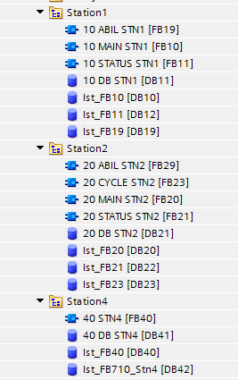
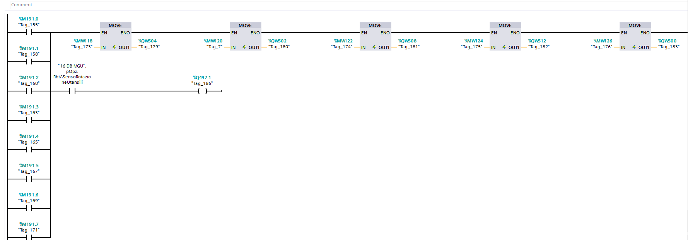
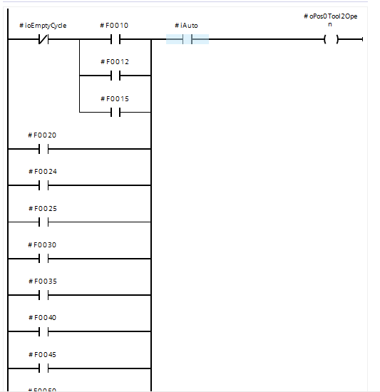
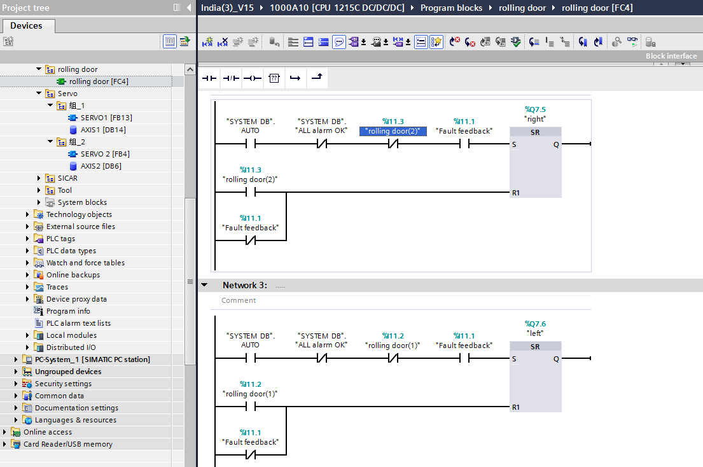

*******************
Bad code
*******************

PLC programs usually are not structured well, neither follow best practice in software engineering.
I notice that more than 95% of PLC programs are written in a horrible way, those are called bad code.

More experience a traditional PLC programmers have, more bad code he write. Reasons can vary from the leak of academic formation to other reasons.
Even computer engineers write too bad code.

The main reason of bad code in PLC are come from the 2 dominant platforms: Siemens S7 and Allen Bradley PLCs.
These platforms have a bad IDE and program organization. Even with Siemens new platform, TIA Portal, few things changed.

When someone begin to learn with these platforms, bad habits will accompany him for all his career.
Using only one language or similar platform, is always a penalty.

A more advanced PLC based on CoDeSys and the standard IEC-61131, let you program a PLC like programming in C++.
The IEC-61131 ``ST`` language have more features than Siemens and Allen Bradley PLCs.
It support enumerations, classes, inheritances. Languages are variable name based, not address based like Siemens.

Tia portal become variable based, compared to the old Step 7. But Siemens keep function and data block numbers for an unknown reason.
The reason can't be retro compatibility, if you open a project in Tia Portal 15, you can anymore open it in TIA portal 14.

Naming
=========

    Groups and functions without a good name

.. figure:: images/bad_code/bad_name_tags1.png
    :align: center
    :figwidth: 400px

    Variables without name neither comment

.. figure:: images/bad_code/bad_name_tags2.png
    :align: center
    :figwidth: 400px

    How can remember the meaning of the variables?

.. figure:: images/bad_code/bad_name_tags3.png
    :align: center
    :figwidth: 400px

    How can remember the meaning of the variables?

    No significant name

.. figure:: images/bad_code/bad_name_states1.png
    :align: center
    :figwidth: 400px

    State machine without state name neither comment

    State machine without state name neither comment

Code reuse
============

A project have three cells, every cell have two rotating tables. The following snippet shown two function blocks without local variables for two tables in the same cell.

.. figure:: images/bad_code/table_1.png
    :align: center
    :figwidth: 400px

    Two tables in Project 1

.. figure:: images/bad_code/table_2.png
    :align: center
    :figwidth: 400px

    Two tables in Project 1

For the project the same logic was written six times at the beginning. During debugging a lot of malfunctioning were found.
The six function blocks was modified again six times.

Another project have similar tables, the logic was written also 2 times for the 2 tables.
In this project we can see also some difference in the program, even if the two tables should have the same logic.

.. figure:: images/bad_code/table_3.png
    :align: center
    :figwidth: 400px

    Two tables in Project 2

At the end the logic of the turntable was written 8 times, and debugged more than 100 times. You can imagine how much time were wasted.

The logic of the same device in two different projects was written 2 times. If a function block with local variable was used, code duplication were avoided and time were saved.

    Rolling shutter in Project 1

.. figure:: images/bad_code/shutter_2.png
    :align: center
    :figwidth: 400px

    Rolling shutter in Project 2

General
=========

In the following picture, a variable was assigned to other different variables, in different functions, before arriving to the output.
During debugging is difficult to find any bug. Anyway this have no meaning.

.. figure:: images/bad_code/no_direct_assign.png
    :align: center
    :figwidth: 400px

When transferring data, e.g. from a recipe, group the variables in a ``struct`` and use block transfer.
When dealing with assignments, it is better to use ST language than Ladder.

.. figure:: images/bad_code/use_structure_udt.png
    :align: center
    :figwidth: 500px

Two much conditions are present in this rung. When a rung become big, bigger than the screen it become difficult to debug.

.. figure:: images/bad_code/too_mcuh_conditions.png
    :align: center
    :figwidth: 400px
