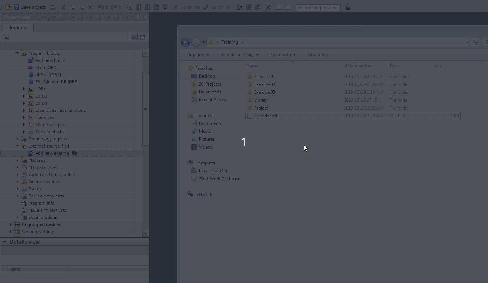
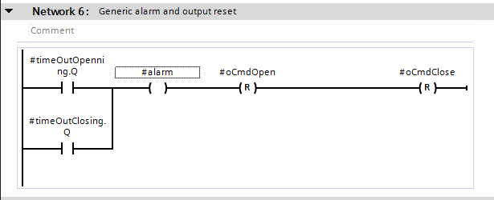

*******************
Solutions
*******************

.. note::

  Complete and tested solution can be found in the OpenLib Library

:download:`Download Exercises solutions TIA Portal 15 <../../../code/Exercises/Siemens/Exercises/Exercises.zip>`

Functions written in SCL can be exported and imported.

.. figure:: images/scl_export.gif
    :align: center
    :figwidth: 600px

    Export a function (FB or FC) written in SCL to a file

    Import an external source and generate the function

You can copy the code of the solution to a text file, save it with extension ``.scl`` then import it to TIA.
Otherwise check the project file if you have Tia Portal version greater than 15.

Line equation
==============

.. literalinclude:: ../../../code/Exercises/Siemens/Exercises/scl/LineEquation.scl

Suppose we have a temperature sensor connected to the analog input of the PLC.
The analog input read an ``int``, 16-bit signed value between -32768 (-2^15) and 32767 (2^15 - 1).

.. figure:: images/s7-1200-AI.png
    :align: center
    :figwidth: 600px

The s7-1200 AI data sheet show the mapping between tension (voltage) and corresponding numerical value.

The temperature sensor datasheet, will show the mapping between the tension and the temperature.
In the PLC program we have to map from AI numerical value to tension, than from tension to temperature.

.. figure:: images/analog_in_scale.png
    :align: center
    :figwidth: 600px

    Use example of linear function

Rising edge
=============

Falling Edge
=============

Retentive TON
==============

Blink
=======

.. literalinclude:: ../../../code/Exercises/Siemens/Exercises/scl/Blink.scl

Bi-stable cylinder
=====================
A simple and functional solution in ladder is presented. A complete solution can be found in the library, and a state machine implementation can be found in the ``state machine`` chapter.

Physical IO may be:
  - Two digital inputs: proximity sensors
  - Two digital outputs: valve solenoid

Interaction with operators may be via physical push buttons, or software buttons (from HMI). The interaction may be with other devices like robots or the PLC itself depending on the plant. But from our point of view they are all the same, and we summarize them as open and close requests.

We can add also a stop request, and other things. But for now, we keep the solution simple.

.. figure:: images/cylinder_ld/var.png
    :align: center
    :figwidth: 600px

    Variables and interface

The cylinder in normal operations, at rest, can be in a single state, or opened or closed.

.. figure:: images/cylinder_ld/s1.png
    :align: center
    :figwidth: 500px

    States: Opened and closed

The cylinder can be opened, if it is not opened and receive a request to open. What if someone send the request to open and close in the same time? So we need to be sure to receive only one request.

.. figure:: images/cylinder_ld/s2.png
    :align: center
    :figwidth: 500px

    Commands: open and close

The cylinder may not respond to our requests, maybe there is no compressed air. Or the command execution was interrupted, e.g. heavy load, or someone leave some object in middle of the way. The execution time for opening and closing may be different, e.g. the cylinder take more time to open because it push some heavy object, but while closing is free from any load.

When we send the opening request and we didn't get the opened state for a predefined time, we have an abnormal situation. Keep in mind, the predefined time is greater than the normal operating time, and it differ from application to application. For example, if the cylinder takes normally 5 seconds to open, we set the time to 7 seconds or 8 seconds for the time out.

.. figure:: images/cylinder_ld/s3.png
    :align: center
    :figwidth: 500px

    Time outs: opening and closing

When we get the time out signal, the commands should be resetted .......

    Time outs: reset commands
